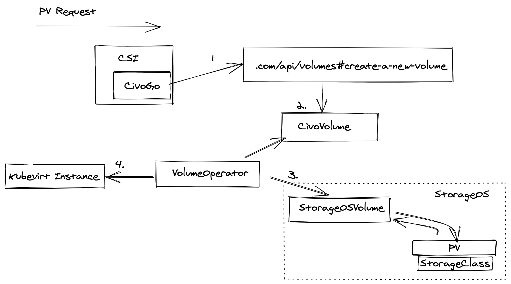

# Civo CSI Driver

This controller is installed in to Civo K3s client clusters and handles the mounting of Civo Volumes on to the
correct nodes and promoting the storage into the cluster as a Persistent Volume.

## Background reading

* [Official Kubernetes CSI announcement blog](https://kubernetes.io/blog/2019/01/15/container-storage-interface-ga/)
* [Official CSI documentation](https://kubernetes-csi.github.io/docs/)
* [Good list of current CSI drivers to see how others have done things](https://kubernetes-csi.github.io/docs/drivers.html)
* [Presentation on how CSI is architected](https://www.usenix.org/sites/default/files/conference/protected-files/vault20_slides_seidman.pdf)
* [Example Hostpath CSI driver](https://github.com/kubernetes-csi/csi-driver-host-path/)
* [Notes on Hostpath CSI driver](https://www.velotio.com/engineering-blog/kubernetes-csi-in-action-explained-with-features-and-use-cases)

## Key takeaways

* We need to enable [dynamic provisioning](https://kubernetes.io/blog/2019/01/15/container-storage-interface-ga/#dynamic-provisioning)
* We're going to build a single binary and use the sidecars to register the appropriate parts of it in the appropriate place (one part runs on the control plane as a deployment, the other part runs on each node as a DaemonSet)

## Getting started

There are three parts to a CSI driver - [node](pkg/driver/node_server.go), [controller](pkg/driver/controller_server.go) and [identity](pkg/driver/identity_server.go). The easiest way to think about these is:

* *identity* just identifies the driver itself: version, capabilities and a probe call to see if it's still alive
* *controller* is responsible for communicating with the external API, to check capacity and provision real world resources, and attach them to the node
* *node* is for after the volume is attached to the underlying node - formatting and mounting it

The order for calls is usually:

1. CSI driver launches and Identity's `GetPluginCapabilities` is called
2. On an ongoing and regular basis Identity's `Probe` is called
3. When a pod requests a PV (dynamically created from a PVC), Controller's `CreateVolume` is called to create it in the Civo API
4. The Kubernetes control plane then calls Controller's `ControllerPublishVolume` to attach the volume to the correct node
5. After the volume is attached Node's `NodeStageVolume` is called to format the volume (if not already formatted) and mount it to a node-wide set of mount points
6. When the volume is formatted and mounted, Node's `NodePublishVolume` is called to bind mount that mount point into the pod's specific mount point.
7. Then the volume is in use normally by the pod. When it's finished with...
8. The bind-mount for the volume is removed with Node's `NodeUnpublishVolume`
9. Then the actual volume is unmounted with Node's `NodeUnstageVolume`.
10. Finally the volume is detached from the instance within Civo's API with Controller's `ControllerUnpublishVolume`.

At this point the volume still exists and still contains data. If the operator wants to delete it, then the `kubectl pv delete ...` will actually call Controller's `DeleteVolume`. If a PV is requested, the Kubernetes control plane will ensure space is available with Controller's `GetCapacity`, and if the operator lists all volumes this is done with Controller's `ListVolumes`.

## Known issues

No currently known issues.

## Workflow

## Development

Normally for our Civo Kubernetes integrations we'd recommend visiting the [getting started document for CivoStack](https://github.com/civo/civo-stack/blob/master/GETTING_STARTED.md) guide, but this is a different situation (installed on the client cluster, not the supercluster), so below are some similar sort of steps to get you started:

### How do I run the driver in development

Unlike Operators, you can't as easily run CSI drivers locally just connected in to a cluster (there is a way with `socat` and forwarding Unix sockets, but we haven't experimented with that yet).

So the way we test our work is:

#### A. Run the test suite

The CSI Sanity suite is integrated as well as some custom unit tests and is a simple `go test` away 🥳

This will run the full Kubernetes Storage SIG's suite of tests against the endpoints we're supposed to have implemented to comply with the spec.

#### B. Install in to a cluster

The steps are:

1. Create an environment variable called `IMAGE_NAME` with a random or recognisable name (`IMAGE_NAME=$(uuidgen | tr '[:upper:]' '[:lower:]')` works well)
2. Build the Docker image with `docker build -t ttl.sh/${IMAGE_NAME}:2h .`
3. Push the Docker image to ttl.sh (a short lived Docker image repository, useful for dev): `docker push ttl.sh/${IMAGE_NAME}:2h`
4. Copy recursively the `deploy/kubernetes` folder to `deploy/kubernetes-dev` with `cp -rv deploy/kubernetes deploy/kubernetes-dev` and replace all occurences of `civo-csi:latest` in there with `YOUR_IMAGE_NAME:2h` (ENV variable interpolation won't work here), this folder is automatically in `.gitignore`
5. In a test cluster (a Civo K3s 1 node cluster will work) you'll need to create a `Secret` within the `civo-system` called `api-access` containing the keys `api-key` set to your Civo API key, `api-url` pointing to either `https://api.civo.com` or a xip.io/ngrok pointing to your local development environment (depending on where your cluster is running) and `region` set to the region the current cluster is running in
6. Deploy the Kubernetes resources required to the cluster with `kubectl apply -f deploy/kubernetes-dev`
